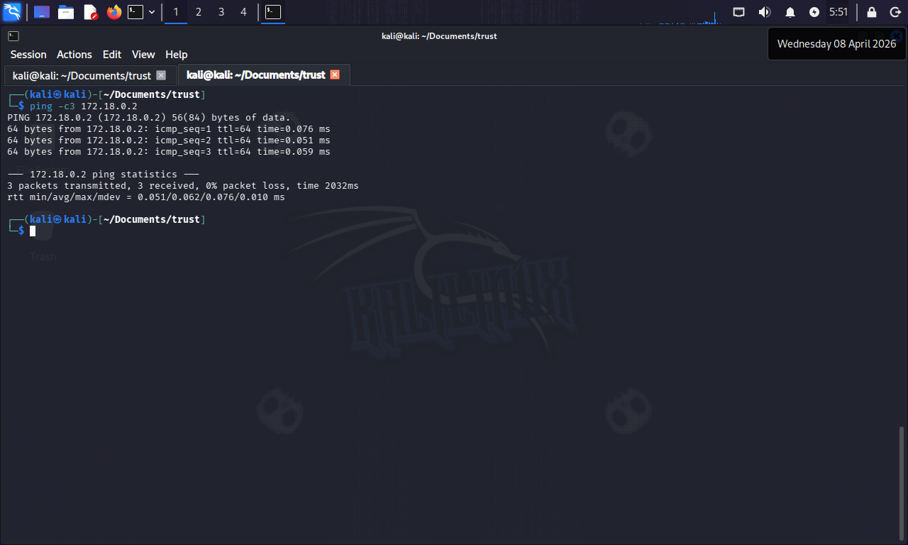
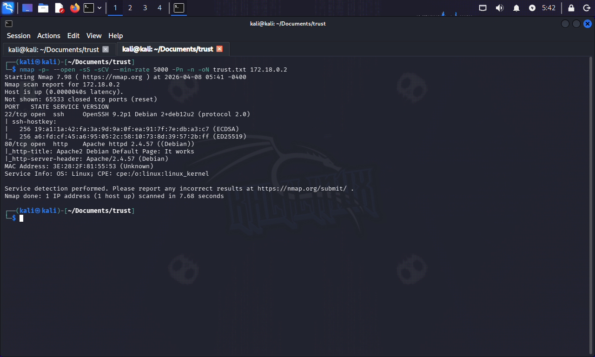

# Trust
**Dificultad**: muy facil  
**Plataforma**: [DockerLabs](https://dockerlabs.es/)  

## Reconocimiento  
Desplegamos el laboratorio con docker usando el siguiente comando:  
` sudo bash auto_deploy.sh trust.tar `  
Esto nos desplegara la maquina y nos dara la direccion IP. Confirmamos que el objetivo este activo:
```bash
ping -c 3 172.18.0.2
``` 
  
El comando `ping -c 3 172.18.0.2` se utiliza en redes para probar la conectividad y medir la latencia hacia un dispositivo con la dirección IP, en este caso `172.18.0.2`.  
  
`ping`: Herramienta que envía paquetes ICMP a un destino y otorga una respuesta.  
`-c 3`: Indica que se enviaran 3 paquetes. Despues de recibir respuestas, el comando finalizara automaticamente.  
`172.18.0.2`: Direccion IP del destino.  

Realizaremos un escaneo de puertos utilizando `nmap`.  

```bash
sudo nmap -p- --open -sS -sCV --min-rate 5000 -Pn -n -oN trust.txt 172.18.0.2
```
`-p-`: Escaneo de todos los puertos.  
`--open`: Muestra solo los puertos abiertos.  
`-sS`: Escaneo SYN. Muestra el estado de los puertos.  
`-sCV`: Detecta versiones de servicio, vulnerabilidades comunes, información de servicios.  
`--min-rate 5000`: Establece una velocidad minima de envio de paquetes (5000 paquetes/s).  
`-Pn`: Omite la fase de descubrimiento de hosts.  
`-n`: Evita consultas DNS.  
`-oN trust.txt`: Guarda los resultados en un archivo .txt (trust.txt).  
`172.18.0.2`: Objetivo.  

  
**Puertos descubiertos**:

    22/tcp - SSH (OpenSSH 9.2p1)
    80/tcp - HTTP (Apache 2.4.57) 

## Exploracion
